# Drug Discovery Platform — Services & Data

> **Project:** `zydusreasoner` · GCP region: `us-central1`  
> Last verified: 2026-06-24

This document maps every running service in the drug-discovery platform, explains what each one does, traces the data flows, and records where frontend interaction data is persisted.

---

## Architecture diagram

[](./network-diagram.svg)

---

## Services

### Frontend

| Service | URL | Infra | Purpose |
|---|---|---|---|
| **drug-discovery-ui** | `https://drug-discovery-ui-jk6up23xdq-uc.a.run.app` | Cloud Run, max 10 | Primary user-facing app (Next.js). Connects exclusively to `pharma-api`. |
| **pharma-ui** | `https://pharma-ui-jk6up23xdq-uc.a.run.app` | Cloud Run, max 3 | Alternate UI, also backed by `pharma-api`. |

Both frontends are stateless — they hold no user data of their own.

---

### Backend API

**`pharma-api`** — `https://pharma-api-jk6up23xdq-uc.a.run.app`  
Cloud Run · min 1 / max 3 · 4 CPU · 8 GiB · always warm

This is the system's central broker. Every user action routes through it. Its responsibilities:

- **Auth** — issues and validates JWT tokens (`JWT_SECRET_KEY` from Secrets Manager); user records live in `pharma-db`
- **Route generation** — delegates to `synthesis-routes-generator` at `http://8.233.250.107` (the MIG load balancer). `ROUTE_STREAMING_ENABLED=true` means results are streamed back to the browser as they arrive
- **Patent enrichment** — calls Perplexity sonar-pro to fetch and summarise relevant patents (`PATENT_ENRICHMENT_ENABLED=true`, capped at 2 patents per query)
- **Procedure drafts** — calls Parallel AI to generate synthesis procedure text (`PROCEDURE_GENERATION_PROVIDER=parallel`)
- **Document retrieval (RAG)** — queries RAGFlow running on `pharma-server` for context from the chemical literature knowledge base
- **LLM calls** — routes through OpenRouter for any generative tasks not handled by Parallel AI

Image tag at time of writing: `pharma-api:v20260624-203354-4db0071`

---

### Retrosynthesis engines

#### synthesis-routes-generator — the production engine

There are **two live deployments** of the same service:

| Deployment | Address | Scale | How reached |
|---|---|---|---|
| **MIG (10 VMs)** | `8.233.250.107` (static IP, TCP LB) | 10 × e2-standard-4, autoscaled | `pharma-api` → `EXTERNAL_RETROSYNTHESIS_URL` |
| **Cloud Run** | `https://synthesis-routes-generator-jk6up23xdq-uc.a.run.app` | max 3 | direct HTTP |

`pharma-api` always hits the MIG. The Cloud Run deployment appears to be a secondary/overflow path.

**MIG startup sequence** (from instance template `synthesis-routes-template-20260624-161644`):
1. Install Cloud SQL Auth Proxy as a systemd service; connects to `pharma-db` on localhost:5432
2. Pull `synthesis-routes-generator.tar.gz` from GCS and extract to `/opt/synthesis-routes-generator`
3. Pull `zinc_stock.hdf5` from GCS to `/opt/synthesis-routes-generator/data/`
4. Pull `PARALLEL_API_KEY` from Secrets Manager
5. Write `.env` and start uvicorn as a systemd service on port 8080

The service itself fans out to four expansion sources per request: ORD literature lookup (pharma-db), SMARTS templates (USPTO model from GCS), Google Patents (via Perplexity), and Claude LLM fallback. It calls `retrosynformer-runner` when `RETROSYNFORMER_ENABLED=true`.

#### retrosynformer-runner

Cloud Run · max 2 · 4 CPU · 16 GiB  
URL: `https://retrosynformer-runner-jk6up23xdq-uc.a.run.app`

Serves the RetroSynFormer Decision Transformer model. Called by `synthesis-routes-generator` with `beam_width=5` and a 30-second timeout. Model files are not baked into the image — they are accessed at runtime via a **GCSFuse read-only mount** of `zydusreasoner-synthesis-data` at `/mnt/synthesis-data`:

```
/mnt/synthesis-data/retrosynformer/model/          ← model.pth checkpoint
/mnt/synthesis-data/retrosynformer/data/
    standard_reaction_templates.pickle
    standard_building_blocks.csv
```

Image: `retrosynformer-runner:20260610-164716`

#### retrodfmr-server

Cloud Run · 1× NVIDIA GPU · 8 CPU · 32 GiB  
URL: `https://retrodfmr-server-jk6up23xdq-uc.a.run.app`

Serves a HuggingFace RetroFormer/ChemFormer model. Not called by `synthesis-routes-generator` or `pharma-api` directly — it is the backend for the AiZynthFinder parallel track (see below). Uses `HF_TOKEN` to pull the model from HuggingFace Hub.

#### AiZynthFinder services

Three Cloud Run services running AiZynthFinder with different expansion backends, operating as a **parallel retrosynthesis track** independent of the main synthesis-routes-generator path:

| Service | Config | Backend |
|---|---|---|
| `aizynthfinder-chemformer` | `/app/config_claude_only.yml` (inferred) | `retrodfmr-server` + OpenRouter |
| `aizynthfinder-track-2` | `/app/config_claude_only.yml` | OpenRouter (Claude) only |
| `aizynthfinder-track-3` | `/app/config_retrodfmr_only.yml` | `retrodfmr-server` only |

These are not currently wired into `pharma-api`'s main route-generation flow.

---

### Infrastructure

**`pharma-server`** — `34.30.139.92` (e2-highmem-8, `us-central1-a`)

A persistent VM running Docker + Docker Compose. Based on the startup script (installs docker, docker-compose, node, python) and the presence of `RAGFLOW_BASE_URL`, `RAGFLOW_API_KEY`, and `RAGFLOW_DATASET_NAME` secrets all pointing at it, this VM hosts a **self-managed RAGFlow instance** — an open-source RAG platform that requires Docker Compose (Elasticsearch, MinIO, MySQL, and the RAGFlow API container). `pharma-api` queries it for chemical literature context to include alongside synthesis routes.

---

## Data storage

### pharma-db — `zydusreasoner:us-central1:pharma-db`

Cloud SQL Postgres 16 · `db-custom-1-3840` (1 vCPU, 3.75 GB RAM) · 69 GB disk · `us-central1-c`  
Accessed via Unix socket path `/cloudsql/zydusreasoner:us-central1:pharma-db` (Cloud Run) or Cloud SQL Auth Proxy on localhost:5432 (MIG VMs).

This is the system's primary operational database. It contains two distinct namespaces:

**`pharma` database** — application data:
- User accounts and credentials (auth is JWT-based; the DB stores the user records that tokens are issued against)
- Synthesis route requests and results stored by `pharma-api` as the broker
- ORD reactions index (2.37 million reactions from the Open Reaction Database) — queried by `synthesis-routes-generator` for literature-backed routes

**`pubchem` schema** (inside `pharma` database) — `pubchem.compound_props` table:
- PubChem molecular complexity scores, keyed by SMILES and InChI key
- Read by `pubchem_complexity.py` to gate which intermediates are expanded during retrosynthesis search (molecules below `PUBCHEM_COMPLEXITY_THRESHOLD=100` become leaves)
- Falls back to PubChem REST API on cache miss, then RDKit estimation

### GCS: `gs://zydusreasoner-synthesis-data/`

| Object | Size / Type | Purpose |
|---|---|---|
| `zinc_stock.hdf5` | 633 MB HDF5 | ZINC 17.4M purchasable building-block InChI keys; purchasability component of the route reward function |
| `synthesis-routes-generator.tar.gz` | tarball | Latest application code; pulled by MIG VMs at every boot |
| `uspto_model.onnx` | ONNX | USPTO reaction template scoring model |
| `uspto_templates.csv.gz` | CSV | 16 curated SMARTS templates for template-based expansion |
| `retrosynformer/model/` | model.pth | RetroSynFormer checkpoint; GCSFuse-mounted by `retrosynformer-runner` |
| `retrosynformer/data/` | .pickle / .csv | Standard reaction templates + building blocks for RetroSynFormer |
| `synthesis-routes-generator.backup-*.tar.gz` | ~55 files | Rolling daily backups of application code (since 2026-06-15) |

### RAGFlow on pharma-server

RAGFlow's Docker Compose stack stores everything locally on the VM:
- **Elasticsearch** — document index and vector embeddings for chemical literature
- **MinIO** — raw uploaded documents (PDFs, papers)
- **MySQL** — RAGFlow metadata (dataset definitions, chunk configs)

This data is **not replicated** — the VM is the single source of truth for the RAG knowledge base. `pharma-api` queries it at `RAGFLOW_BASE_URL` using dataset `RAGFLOW_DATASET_NAME`.

### biochem-db-pubchem — not currently wired in

Cloud SQL Postgres 16 · `db-g1-small` · project `biochem-db-by-hobs`  
Connection: `biochem-db-by-hobs:us-central1:biochem-db-pubchem`

A separately-maintained PubChem compound properties mirror in a different project. Neither `pharma-api` nor the MIG startup script sets a connection string for this instance — the production service reads PubChem complexity from the `pubchem` schema inside `pharma-db` instead.

---

## External integrations

| Service | Used by | Purpose | Key |
|---|---|---|---|
| **Perplexity sonar-pro** | `pharma-api`, `synthesis-routes-generator` MIG | Patent search — queries Google Patents and PubChem via natural language; extracts reactants, conditions, yields | `PERPLEXITY_KEY` (Secrets Manager) |
| **Parallel AI** | `pharma-api`, `synthesis-routes-generator` MIG | Procedure drafts — generates full synthesis procedure text from a route summary | `PARALLEL_API_KEY` (Secrets Manager) |
| **OpenRouter** | `pharma-api`, `aizynthfinder-chemformer`, `aizynthfinder-track-2` | LLM gateway (Claude, etc.) for generative tasks | `OPENROUTER_API_KEY` (Secrets Manager) |
| **PubChem REST API** | `synthesis-routes-generator` MIG | Complexity score fallback when `pubchem.compound_props` has no entry | Public, no key |
| **HuggingFace Hub** | `retrodfmr-server` | Model weights download on container startup | `HF_TOKEN` (env var) |

---

## Frontend application screens

`drug-discovery-ui` is a multi-screen Next.js workflow app. The user progresses linearly through these screens (each has its own `app/` route and a matching `components/` file):

```
Target Selection → Retrosynthesis → Route Evaluation → Experimental Planning
→ Process Optimization → Tech Transfer → Safety & Regulatory → Impurity Analysis
→ Documents → Sessions → Dashboard
```

### API proxy pattern

The frontend **never calls `pharma-api` directly** from the browser. All backend calls go through Next.js API route handlers in `app/api/`:

```
Browser → Next.js API route (/app/api/…) → pharma-api (BACKEND_URL)
                                           → RAGFlow   (RAG_URL)
```

Auth tokens (`access_token`) are stored in an `httpOnly` cookie (1-day expiry) set by the Next.js layer, so they are never accessible to client-side JS.

### Route synthesis: async task pattern

Route generation uses an async polling flow (not a direct synchronous call):

1. `POST /api/v1/route-synthesis/async` → returns `{ task_id }`
2. Poll `GET /api/v1/tasks/{task_id}/status` until `running` → `complete`
3. Fetch `GET /api/v1/tasks/{task_id}/results`

A streaming SSE path also exists (`/api/v1/route-synthesis/stream-sse`) for the real-time streaming display.

---

## Where frontend interaction data is stored

Data lands in three places depending on its nature:

### 1. Browser localStorage — in-progress workflow state

`workflow-context.tsx` serialises the current workflow state to `localStorage` on every state change. This includes:
- Selected molecule (name + SMILES)
- Current screen
- Workflow progress flags
- The selected synthesis route (step metadata; images and citations are stripped to stay under the ~5 MB localStorage quota and re-fetched from the server on resume)

`generatedRoutes` (the full list) is **not persisted** to localStorage — it is regenerated from `pharma-api` on reload.

This is a client-side cache for resuming mid-workflow after a page refresh. It is **not** synced server-side.

### 2. pharma-db — authoritative server-side records

Everything the user commits (rather than just views) is written to `pharma-db` through `pharma-api`:

| User action | Stored as |
|---|---|
| Sign up / log in | User record; JWT is stateless (validated against `JWT_SECRET_KEY`) |
| Start a target-selection session | Session record with `session_id` |
| Generate synthesis routes | Routes attached to the session (`GET /api/sessions/{id}/routes`) |
| Save / evaluate a route | Route record updated with user scores / selections |
| Generate synthesis procedure | Procedure text stored alongside the route |

The `GET /api/sessions` and `GET /api/sessions/{id}/routes` endpoints in the UI read this data back, confirming that sessions and routes are the persisted server-side objects.

### 3. RAGFlow on `pharma-server` — knowledge-base documents and retrieval history

All RAGFlow calls from `drug-discovery-ui` proxy through `pharma-api` using `BACKEND_URL` — the `RAG_URL` env var in `drug-discovery-ui/lib/config.ts` is set but **not actually used** by any Next.js API route handler. The stale `34.180.15.126` hardcoded fallback is dead code; that VM no longer exists. The correct RAGFlow host is `pharma-server` at `34.30.139.92`, accessed exclusively via `pharma-api`.

The frontend exposes full RAGFlow administration routes (`/api/v1/ragflow/datasets`, file upload, auto-curation) that proxy to `pharma-api`, which in turn calls `pharma-server`. Data stored in RAGFlow:
- **Elasticsearch**: document embeddings and vector index for chemical literature
- **MinIO**: raw uploaded files (PDFs, papers)
- **MySQL**: dataset metadata, chunk configurations, retrieval history

**In summary:** the browser holds a lightweight transient cache in `localStorage`; `pharma-db` is the authoritative store for all user sessions, synthesis routes, and procedures; RAGFlow (on a separate VM) holds the chemical-literature knowledge base and retrieval logs.

---

## Quick reference

| Resource | Type | Project | Connection name / URL |
|---|---|---|---|
| `pharma-db` | Cloud SQL Postgres 16 | zydusreasoner | `zydusreasoner:us-central1:pharma-db` |
| `biochem-db-pubchem` | Cloud SQL Postgres 16 | biochem-db-by-hobs | `biochem-db-by-hobs:us-central1:biochem-db-pubchem` |
| `zydusreasoner-synthesis-data` | GCS bucket | zydusreasoner | `gs://zydusreasoner-synthesis-data/` |
| `synthesis-routes-generator` MIG | 10 × e2-standard-4 | zydusreasoner | `8.233.250.107` |
| `pharma-api` | Cloud Run | zydusreasoner | `https://pharma-api-jk6up23xdq-uc.a.run.app` |
| `drug-discovery-ui` | Cloud Run | zydusreasoner | `https://drug-discovery-ui-jk6up23xdq-uc.a.run.app` |
| `retrosynformer-runner` | Cloud Run | zydusreasoner | `https://retrosynformer-runner-jk6up23xdq-uc.a.run.app` |
| `retrodfmr-server` | Cloud Run (GPU) | zydusreasoner | `https://retrodfmr-server-jk6up23xdq-uc.a.run.app` |
| `pharma-server` (RAGFlow) | e2-highmem-8 VM | zydusreasoner | `34.30.139.92` |
| `pharma-images` registry | Artifact Registry | zydusreasoner | `us-central1-docker.pkg.dev/zydusreasoner/pharma-images/` |
