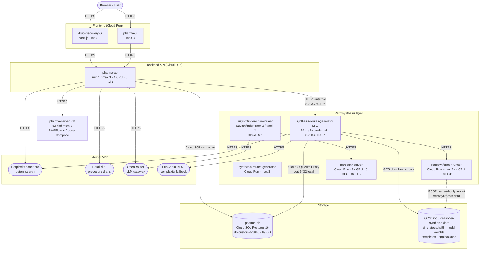

```mermaid
graph TD
    %% ── User tier ──────────────────────────────────────────────
    User(["Browser / User"])

    subgraph FRONTEND["Frontend  (Cloud Run)"]
        DDU["drug-discovery-ui\nNext.js · max 10"]
        PUI["pharma-ui\nmax 3"]
    end

    %% ── Backend API ────────────────────────────────────────────
    subgraph API_TIER["Backend API  (Cloud Run)"]
        PAPI["pharma-api\nmin 1 / max 3 · 4 CPU · 8 GiB"]
    end

    %% ── Retrosynthesis engines ─────────────────────────────────
    subgraph SYNTH["Retrosynthesis layer"]
        SRG["synthesis-routes-generator MIG\n10 × e2-standard-4 · 8.233.250.107"]
        SRGCR["synthesis-routes-generator\nCloud Run · max 3"]
        RSF["retrosynformer-runner\nCloud Run · max 2 · 4 CPU · 16 GiB"]
        RETRODFMR["retrodfmr-server\nCloud Run · 1× GPU · 8 CPU · 32 GiB"]
        AIZYNTH["aizynthfinder-chemformer\naizynthfinder-track-2 / track-3\nCloud Run"]
    end

    %% ── Storage ────────────────────────────────────────────────
    subgraph STORAGE["Storage"]
        DB[("pharma-db\nCloud SQL Postgres 16\ndb-custom-1-3840 · 69 GB")]
        GCS[("GCS: zydusreasoner-synthesis-data\nzinc_stock.hdf5 · model weights\ntemplates · app backups")]
    end

    %% ── Infrastructure VM ──────────────────────────────────────
    PHARMASERVER["pharma-server VM\ne2-highmem-8\nRAGFlow + Docker Compose"]

    %% ── External APIs ──────────────────────────────────────────
    subgraph EXTERNAL["External APIs"]
        PERPLEXITY(["Perplexity sonar-pro\npatent search"])
        PARALLEL(["Parallel AI\nprocedure drafts"])
        OPENROUTER(["OpenRouter\nLLM gateway"])
        PUBCHEM(["PubChem REST\ncomplexity fallback"])
    end

    %% ── Flows ───────────────────────────────────────────────────
    User -->|HTTPS| DDU
    User -->|HTTPS| PUI
    DDU -->|HTTPS| PAPI
    PUI -->|HTTPS| PAPI

    PAPI -->|"HTTP · internal\n8.233.250.107"| SRG
    PAPI -->|Cloud SQL connector| DB
    PAPI -->|HTTPS| PHARMASERVER
    PAPI -->|HTTPS| PERPLEXITY
    PAPI -->|HTTPS| PARALLEL
    PAPI -->|HTTPS| OPENROUTER

    SRG -->|"Cloud SQL Auth Proxy\nport 5432 local"| DB
    SRG -->|GCS download at boot| GCS
    SRG -->|HTTPS| RSF
    SRG -->|HTTPS| PERPLEXITY
    SRG -->|HTTPS| PUBCHEM

    RSF -. "GCSFuse read-only mount\n/mnt/synthesis-data" .-> GCS

    AIZYNTH -->|HTTPS| RETRODFMR
    AIZYNTH -->|HTTPS| OPENROUTER
```
